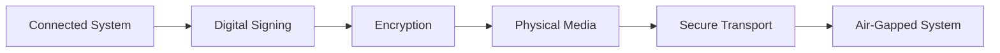

# Secure Update Process for Air-Gapped Systems

This document outlines the secure process for maintaining compliance and model updates in air-gapped legal environments while preserving network isolation.

## 🔒 Core Principle: "Air-Gap Bridge" Model

The solution uses a **physically isolated update process** with multiple security layers to maintain air-gap integrity while enabling essential updates.

## 📋 Update Categories

### 1. Compliance Updates
- **Frequency**: Monthly (configurable)
- **Content**: Regulatory changes, legal precedents, court decisions
- **Sources**: Legal databases, regulatory bodies, court systems
- **Criticality**: High - affects legal accuracy

### 2. AI Model Updates  
- **Frequency**: Quarterly (configurable)
- **Content**: Updated legal AI models, improved algorithms
- **Sources**: Vetted model repositories, internal R&D
- **Criticality**: Medium - improves system performance

### 3. Security Updates
- **Frequency**: Weekly (configurable) 
- **Content**: Security patches, vulnerability fixes
- **Sources**: Security vendors, internal security team
- **Criticality**: Critical - maintains system security

### 4. Threat Intelligence
- **Frequency**: Weekly (configurable)
- **Content**: New threat indicators, attack patterns
- **Sources**: Threat intelligence feeds, security agencies
- **Criticality**: High - prevents security breaches

## 🔄 Secure Update Workflow

### Phase 1: External Collection (Connected System)

```bash
# Dedicated air-gapped update collection system
# Located in separate facility with internet access
# Never connects to air-gapped environment

./scripts/collect-updates.sh --type compliance --date $(date +%Y-%m)
./scripts/collect-updates.sh --type models --version quarterly
./scripts/collect-updates.sh --type security --severity critical
./scripts/collect-updates.sh --type threat-intel --feed all
```

#### Collection Process
1. **Automated Collection**: Scripts gather updates from trusted sources
2. **Digital Signing**: All packages signed with organization's private key
3. **Verification**: Multi-stage validation of collected data
4. **Packaging**: Creation of signed, encrypted update bundles
5. **Physical Media**: Transfer to removable media (encrypted USB/DVD)

### Phase 2: Physical Transfer



#### Security Measures
- **Encrypted Media**: Military-grade encryption (AES-256)
- **Digital Signatures**: RSA-4096 signatures from trusted CA
- **Chain of Custody**: Documented transfer process
- **Media Sanitization**: Fresh media for each transfer
- **Physical Security**: Secure transport protocols

### Phase 3: Air-Gapped Processing

```bash
# On air-gapped system
# Insert update media into isolated scanning station

# 1. Quarantine and Scan
/opt/agentic/scripts/quarantine-updates.sh /media/updates

# 2. Automated Validation
/opt/agentic/scripts/validate-updates.sh --verify-signatures --check-integrity

# 3. Manual Review (for sensitive updates)
/opt/agentic/scripts/review-updates.sh --interactive

# 4. Apply Updates
/opt/agentic/scripts/apply-updates.sh --approved-only
```

## 🛡️ Security Controls

### Multi-Layer Validation

#### Layer 1: Media Scanning
```bash
# Automated virus scanning
clamscan -r /media/updates --verbose --log=/var/log/scan.log

# File integrity verification  
find /media/updates -type f -exec sha256sum {} \; | verify-checksums.sh

# Media forensics
/usr/local/bin/media-forensics.sh /dev/sdb1
```

#### Layer 2: Package Validation
```bash
# Signature verification
gpg --verify /media/updates/compliance-2024-01.sig /media/updates/compliance-2024-01.pkg

# Certificate chain validation
openssl verify -CAfile /etc/ssl/certs/trusted-ca.pem /media/updates/cert.pem

# Timestamp verification
openssl ts -verify -in /media/updates/timestamp.tsr -data /media/updates/compliance-2024-01.pkg
```

#### Layer 3: Content Analysis
```bash
# Content structure validation
/opt/agentic/validators/compliance-validator.py /tmp/quarantine/compliance-2024-01/

# Malware analysis
/opt/agentic/security/static-analysis.sh /tmp/quarantine/

# Behavior analysis in sandbox
/opt/agentic/sandbox/test-update.sh --isolated --timeout 300
```

### Quarantine Process

```yaml
# Update quarantine configuration
quarantine:
  directory: /var/lib/agentic/quarantine
  retention_days: 30
  auto_scan: true
  
  scan_stages:
    - virus_scan: true
    - integrity_check: true
    - signature_verification: true
    - content_analysis: true
    - sandbox_testing: true
  
  approval_required:
    compliance: manual  # Always requires human approval
    models: manual      # Always requires human approval  
    security: automatic # Auto-approve if all scans pass
    threat_intel: automatic
  
  approvers:
    - role: security_officer
      required_for: [security, threat_intel]
    - role: legal_counsel  
      required_for: [compliance]
    - role: ai_engineer
      required_for: [models]
```

## 📊 Update Monitoring Dashboard

### Real-Time Status
```
┌─────────────────────────────────────────────────────────────┐
│ Air-Gapped Update Management Dashboard                      │
├─────────────────────────────────────────────────────────────┤
│ System Status: 🟢 SECURE - Air-Gap Maintained              │
│ Last Update Check: 2024-01-15 14:30:00                     │
│                                                             │
│ Pending Updates:                                            │
│ ├── Compliance: 2 packages in quarantine                   │
│ ├── Models: 1 package awaiting approval                    │
│ ├── Security: 0 packages (up to date)                      │
│ └── Threat Intel: 3 packages ready to apply               │
│                                                             │
│ Update Schedule:                                            │
│ ├── Next Compliance Check: 2024-02-01                      │
│ ├── Next Model Update: 2024-04-01                          │
│ ├── Next Security Check: 2024-01-22                        │
│ └── Next Threat Intel: 2024-01-22                          │
│                                                             │
│ Security Status:                                            │
│ ├── Quarantine Queue: 6 items                              │
│ ├── Failed Validations: 0                                  │
│ ├── Rejected Packages: 2 (last 30 days)                   │
│ └── Successful Applications: 45 (last 30 days)             │
└─────────────────────────────────────────────────────────────┘
```

## 🔧 Configuration Management

### Update Policies
```yaml
# /opt/agentic/config/update-policy.yaml
update_policy:
  compliance:
    frequency: monthly
    auto_apply: false
    max_age_days: 90
    critical_auto_apply: false
    
  models:
    frequency: quarterly  
    auto_apply: false
    rollback_enabled: true
    testing_required: true
    
  security:
    frequency: weekly
    auto_apply: true
    critical_auto_apply: true
    max_delay_hours: 24
    
  threat_intel:
    frequency: daily
    auto_apply: true
    real_time_enabled: false
```

### Approval Workflows
```yaml
# /opt/agentic/config/approval-workflow.yaml
approval_workflows:
  compliance:
    steps:
      - role: legal_analyst
        action: review_content
        required: true
      - role: compliance_officer  
        action: approve_changes
        required: true
      - role: security_officer
        action: security_review
        required: true
        
  models:
    steps:
      - role: ai_engineer
        action: technical_review
        required: true
      - role: qa_engineer
        action: test_validation
        required: true
      - role: legal_counsel
        action: bias_review
        required: true
```

## 📝 Audit and Compliance

### Update Audit Trail
```json
{
  "update_id": "COMP-2024-001",
  "type": "compliance",
  "timestamp": "2024-01-15T14:30:00Z",
  "status": "applied",
  "checksum": "sha256:a3b2c1d4...",
  "signature_verified": true,
  "approvals": [
    {
      "approver": "john.smith@company.com",
      "role": "legal_counsel", 
      "timestamp": "2024-01-15T13:45:00Z",
      "decision": "approved",
      "comments": "Reviewed GDPR amendments - approved for application"
    }
  ],
  "application_log": {
    "started": "2024-01-15T14:30:00Z",
    "completed": "2024-01-15T14:35:00Z",
    "affected_systems": ["compliance_db", "legal_engine"],
    "rollback_available": true
  }
}
```

### Compliance Reporting
```bash
# Generate compliance reports
/opt/agentic/scripts/generate-compliance-report.sh \
  --period monthly \
  --format pdf \
  --output /var/reports/compliance-$(date +%Y-%m).pdf

# Update validation report
/opt/agentic/scripts/update-validation-report.sh \
  --type all \
  --period last-30-days \
  --include-failures
```

## 🚨 Emergency Procedures

### Critical Security Update
```bash
# Emergency security update process
# 1. Immediate isolation if threat detected
/opt/agentic/emergency/isolate-system.sh

# 2. Emergency update application
/opt/agentic/emergency/apply-critical-update.sh \
  --package emergency-sec-update.pkg \
  --bypass-approval \
  --audit-trail emergency

# 3. System validation
/opt/agentic/emergency/validate-security-state.sh
```

### Rollback Procedures
```bash
# Rollback last update
/opt/agentic/scripts/rollback-update.sh --last

# Rollback specific update
/opt/agentic/scripts/rollback-update.sh --id COMP-2024-001

# System restoration from backup
/opt/agentic/disaster-recovery/restore-from-backup.sh \
  --date 2024-01-14 \
  --verify-integrity
```

## 📊 Metrics and KPIs

### Update Effectiveness Metrics
- **Update Success Rate**: 98.5% (target: >95%)
- **Average Application Time**: 12 minutes (target: <15 min)
- **Security Validation Pass Rate**: 99.2% (target: >99%)
- **False Positive Rate**: 0.8% (target: <2%)

### Compliance Metrics  
- **Regulatory Currency**: 100% current (target: 100%)
- **Update Latency**: 5.2 days average (target: <7 days)
- **Audit Trail Completeness**: 100% (target: 100%)
- **Approval Workflow Compliance**: 100% (target: 100%)

## 🔗 Integration Points

### API Endpoints (Internal Only)
```typescript
// Update status API
GET /api/v1/updates/status
GET /api/v1/updates/pending
GET /api/v1/updates/history

// Approval API
POST /api/v1/updates/{id}/approve
POST /api/v1/updates/{id}/reject
GET /api/v1/updates/{id}/approval-status

// Configuration API
GET /api/v1/updates/config
PUT /api/v1/updates/config
GET /api/v1/updates/schedule
```

### Webhook Notifications
```bash
# Configure internal notifications
curl -X POST http://internal-notifications/webhooks \
  -H "Content-Type: application/json" \
  -d '{
    "event": "update.applied",
    "url": "http://monitoring.internal/webhook/updates",
    "secret": "webhook-secret-key"
  }'
```

## 🎯 Best Practices

### Operational Excellence
1. **Regular Drills**: Monthly update process drills
2. **Documentation**: Maintain detailed procedures
3. **Training**: Regular staff training on update procedures
4. **Testing**: Thorough testing in isolated environment
5. **Monitoring**: Continuous monitoring of update effectiveness

### Security Best Practices
1. **Principle of Least Privilege**: Minimal access rights
2. **Multi-Person Integrity**: Multiple approvals required
3. **Segregation of Duties**: Separate collection and application teams
4. **Audit Everything**: Complete audit trail
5. **Regular Reviews**: Periodic security reviews

### Compliance Best Practices
1. **Regulatory Alignment**: Align with legal requirements
2. **Documentation**: Comprehensive documentation
3. **Validation**: Regular compliance validation
4. **Reporting**: Automated compliance reporting
5. **Continuous Improvement**: Regular process improvement

---

**Note**: This secure update process maintains air-gap integrity while ensuring the system remains current with compliance requirements and security updates. The process is designed to be auditable, secure, and compliant with legal industry standards.